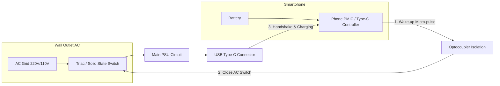

# true-zero-standby-charger
An open-source hardware concept for true 0.000W standby power chargers triggered by a reverse smartphone micro-pulse.

# True Zero Standby Charger (Open-Source Concept)

⚠️ **PROJECT STATUS: THEORETICAL CONCEPT (UNTESTED)**
*This repository contains an open-source hardware concept. The author currently does not have the resources or equipment to build a physical prototype. The circuit, logic, and timings require validation on an electronics testbench.*

## 💡 The Problem
Modern tech giants (Apple, Samsung, Google, etc.) have removed power bricks from smartphone boxes under the guise of "eco-friendliness" and reducing carbon footprints. However, this is largely corporate greenwashing. 

Billions of chargers worldwide remain plugged into wall outlets 24/7 in an idle state. They constantly consume phantom load/standby power (up to 0.075W allowed by Energy Star standards), heat up, degrade from overnight grid voltage spikes, and create fire hazards. In global scales, this leaks terawatts of generated electricity into pure waste.

## 🚀 The Solution: True Zero Standby
This technology shifts the wake-up logic entirely to the smartphone side. This allows the power supply unit (PSU) to completely isolate its high-voltage (220V/110V) AC input stage via an electronic switch when no phone is connected. 

Power consumption from the grid in standby mode is **strictly 0.000W**.

### System Architecture (Flowchart)

## 🔄 How It Works (Step-by-Step Logic)
1. **Deep Sleep (Anabiosis):** The charger is plugged into the wall. The input Triac/MOSFET is open. The high-voltage stage is completely dead. Grid power consumption is 0.000W. There is no voltage on the cable ends.
2. **Physical Connection:** The user plugs the Type-C cable into a smartphone. Due to built-in moisture/port-detection features (like in modern Samsung or iPhone devices), the phone senses a change in capacitance and resistance on the CC lines. The phone recognizes a cable is attached.
3. **Reverse Micro-Pulse:** The phone's Power Management IC (PMIC) temporarily switches the Type-C port into source (OTG) mode for 10–20 milliseconds, sending a tiny low-voltage current pulse down the cable.
4. **PSU Ignition:** This pulse reaches the charger and activates the low-voltage side of an **optocoupler** (ensuring galvanic isolation and absolute user safety). The optocoupler triggers the Triac, and **AC grid power instantly flows into the main PSU circuit**. The charger wakes up.
5. **Digital Handshake (Safety Guard):** The awakened charger must initiate a digital "handshake" (USB Power Delivery) with the smartphone within 50–100 ms.
   - **Success:** The PD protocol is established, the PSU takes over the power role, and fast charging begins. The phone reverts to standard sink (sink/consumer) mode.
   - **Fail (False Positive / Dirt / Water / Short Circuit):** If no valid digital response is received from the device within the timeout, the charger instantly cuts the input Triac and drops back into 0W sleep.

## ⚠️ Known Edge Cases & Theoretical Flaws
The main engineering bottleneck identified during the design phase:

* **The "Dead Battery" Loop (0% State-of-Charge):** If a smartphone battery is completely depleted to the point where the device is turned off, the internal PMIC is unpowered. It cannot generate the reverse wake-up pulse. The charger will stay asleep, and the phone will stay dead.
* **Proposed Workarounds for Community Testing:**
  1. *Hardware Battery Reserve:* Modern smartphones keep 3–5% of actual capacity hidden below "0%" to power safety chips. The Type-C controller could be wired to fire the wake-up pulse using this deep reserve layer.
  2. *Mechanical Piezo Trigger:* Embedding a tiny, low-cost piezo-element inside the Type-C connector plug. The physical force of snapping the cable into the phone generates enough micro-voltage to trip the optocoupler, completely independent of the phone's battery.
  3. *Emergency Bypass Button:* A tiny tactile button on the charger brick. Pressing it closes the Triac manually for 1 second to supply basic 5V, booting up the dead phone's controller to take over the handshake logic.

## 🛠 Help Needed (Tasks for the Community)
- [ ] Design a low-cost, minimal component input switch circuit (Triac + Optocoupler) with the fastest possible reaction time.
- [ ] Verify if modern smartphone PMICs can fire trigger pulses via firmware updates without modifying phone hardware.
- [ ] Build a low-voltage simulation bench using two Arduino/ESP32 boards to refine handshake timeouts.

## 📜 License
This concept is licensed under the **MIT License**. You are completely free to use, modify, and integrate this architecture into commercial products, provided that original authorship credit is maintained.
